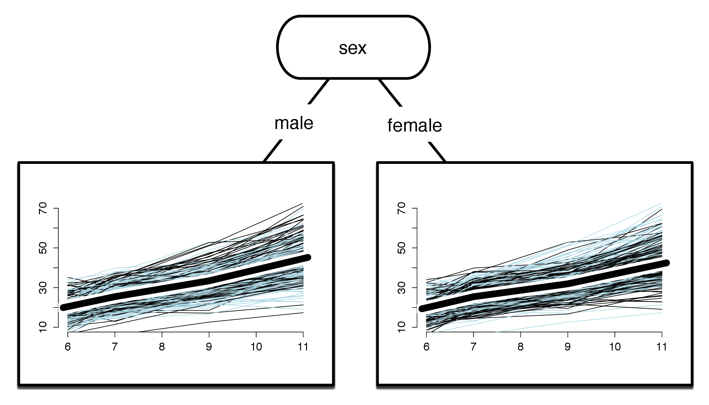
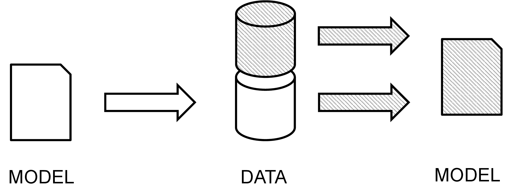

```{r setup, include=FALSE}
options(htmltools.dir.version = FALSE)
knitr::opts_chunk$set(
  fig.width=9, fig.height=3.5, fig.retina=3,
  out.width = "100%",
  cache = FALSE,
  echo = FALSE,
  message = FALSE, 
  warning = FALSE,
  hiline = TRUE
)


library(RefManageR)
BibOptions(check.entries = FALSE, bib.style = "authoryear", style = "markdown",
           dashed = TRUE)
bib <- ReadBib("references.bib")
```

```{r xaringan-themer, include=FALSE, warning=FALSE}
library(xaringanthemer)


primary_color <- "#FFFFFF" #"#024959"
secondary_color <- "#024959"#"#F2D605"
xaringanthemer::style_duo(
  primary_color = primary_color,
  secondary_color = secondary_color,
  header_font_google = google_font("Didact Gothic", "400", "400i"),
  text_font_google   = google_font("IBM Plex Sans", "400", "400i"),
  text_font_size = "1.5rem",
  )

style_extra_css(css = list(".todo" = list(color = "#17C25B"),
                           ".optional" = list(color = "#05BCE6"),
                           ".large" = list(`font-size` = "130%"),
                           ".small" = list(`font-size` = "80%"),
                           ".tiny" = list(`font-size` = "50%"),
                           ".full" = list(padding = "0px",
                                          margin = "0px",
                                          border = "0px"),
                           ".vertical" = list(`writing-mode` = "vertical-rl",
                                              `text-orientation` = "mixed")),
                )


library(semtree)
library(ggplot2)
library(tidyverse)
library(svglite)
library(qrcode)

```


class: inverse center middle

# Decision Trees + SEM + Random Forests + Variable Importance + BORUTA


Roadmap
---

# Decision Trees

<center>


`r Citet(bib, "gigerenzer2005fast")`

---
 
# Data-driven modeling


---

# SEM

```{r}
knitr::include_graphics("img/SEM-measurement-structure.png")
```
---
# Theory-driven modeling


---
class: inverse, center, middle
# SEM Trees

<small>`r Citet(bib, "brandmaier2013structural")`</small>
---

# A Simple Example: Wechsler Intelligence Scale for Children

.pull-left[

]

.pull-right[

]
---
# A Simple Example: WISC


<center>


---

# A Simple Example: WISC


<center>


---

# A Simple Example: WISC

<center>


---

# A Simple Example: WISC


---

# Theory-guided exploration


<small>`r Citet(bib,"brandmaier2016theory")` </small>

---

# Variable Importance

.pull-left[
- subsample data and predictors to create a forest with diverse predictor combinations
- using a permutation approach, estimate contribution of each predictor
]

.pull-right[

Terminal decline of happiness from SOEP data
`r Citet(bib,"brandmaier2017terminal")` 
]

<small>`r Citet(bib,"brandmaier2016theory")` </small>

---
class: inverse, center, middle
# BORUTA

<center></center>

A spirit or devil from slavic mythology, <small>image from Wikipedia/Public Domain</small>

---

# Idea

- Create random copies of all predictors (_shadow features_)
- Run a predictive model with original and shadow features
- Compute a measure of variable importance from a SEM forest
- Only keep original predictors more important than shadow features

---

# Algorithm

- Create a copy of the original data set
- Create shadow features by permutation of all non-rejected features (remove association of shadow features with outcome(s) )
- At each iteration, compute z-score of all original and shadow features
- A feature is considered relevant if it performs better than the best shadow feature ('hit')
- Run a statistical test for each original predictor (H0: hits so far are just random)
- If significant, tag predictor as 'confirmed' or 'rejected', otherwise leave as 'tentative'


---
# Let's fuse all those things!

<center>


---
class: inverse center middle

# A minimal simulation


---
# Setup

- Randomly draw $x1$ to $x6$ from ${0,1,2}$
- Generate a dataset of $N=1000$
- Compute outcome according to: 
$$y = x1+5\cdot x2+0.1\cdot x6+\mathcal{N}(0,0.01)$$
---
# A simple SEM tree
```{r}
tree_ex1 <- readRDS("results/ex1/tree.rds")
plot(semtree::prune(tree_ex1,2))
```
---
# Variable Importance

```{r}
vim<-readRDS("results/ex1/vi.rds" )
plot(vim)
```
---

# BORUTA results

```{r}
boruta_results <- readRDS("results/sim1/boruta_result.rds")
plot(boruta_results)
```
---
class: center middle inverse

# Example: Depression Anxiety Stress Scales (DASS)
--- 
# Example: DASS

- open data from openpsychometrics.org
- data was collected with an online version of the Depression Anxiety Stress Scales (DASS) (http://www2.psy.unsw.edu.au/dass/)
- 2df outcome model with mean and variance of the DASS sum score
- predictors: age, education, gender, handedness, urban, family size, screen size, voted
---
# SEM Tree with DASS

```{r}
tree <- readRDS("results/ex3/tree.rds")
plot(tree)
```
---
# SEM Tree with DASS (zoom in)

---
```{r}
tree <- readRDS("results/ex3/tree.rds")
plot(semtree::prune(tree,2))
```
---

# Example: DASS
```{r}
boruta_results<-readRDS("results/ex3/boruta_results_run2.rds")
plot(boruta_results)
```

---
# Parallelization

- Iterations of BORUTA must remain sequential (because of possible rejections)

- Parallelization of forests and variable importance calculation is costly and can be parallelized using `future`

```{r echo=TRUE, eval=FALSE}
plan(multisession, workers = 4)

boruta_result<-boruta(sem_model, DASS_data)
```
---

# Discussion

- BORUTA is a naive wrapper algorithm and computationally quite costly 
- Difficult wording of "confirmation" and "rejection"
- As always: type-I and type-II errors depend on sample size, effect size, multiple testing adjustments
- Categorization really helpful for theory advancement?

---
# Thank You


.pull-left[

1. https://github.com/brandmaier/boruta_presentation_dgps
2. https://github.com/brandmaier/semtree
3. Contact: andreas.brandmaier@medicalschool-berlin.de or @brandmaier on X or @brandmaier.bsky.social on Bluesky

]

.pull-right[

```{r, echo=FALSE}
link <- "https://github.com/brandmaier/boruta_presentation_dgps"
```

```{r, echo=FALSE, out.width = "30%", out.extra='style="float:center"'}
if (!file.exists("img/qr_slides.svg")) {
generate_svg(qr_code(link), here::here("img/", "qr_slides.svg"), foreground = secondary_color, background = primary_color, show = FALSE)
}
knitr::include_graphics("img/qr_slides.svg")
```
]
---
# References

```{r, results='asis', echo=FALSE}
PrintBibliography(bib)
```
