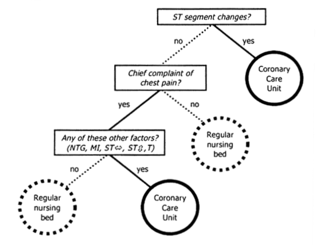
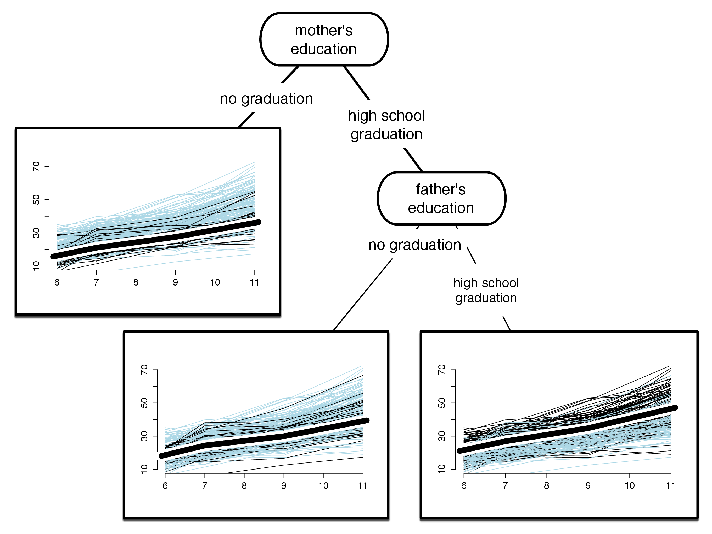

```{r setup, include=FALSE}
options(htmltools.dir.version = FALSE)
knitr::opts_chunk$set(
  fig.width=9, fig.height=3.5, fig.retina=3,
  out.width = "100%",
  cache = FALSE,
  echo = FALSE,
  message = FALSE, 
  warning = FALSE,
  hiline = TRUE
)
```

```{r xaringan-themer, include=FALSE, warning=FALSE}
library(xaringanthemer)


primary_color <- "#FFFFFF" #"#024959"
secondary_color <- "#024959"#"#F2D605"
xaringanthemer::style_duo(
  primary_color = primary_color,
  secondary_color = secondary_color,
  header_font_google = google_font("Didact Gothic", "400", "400i"),
  text_font_google   = google_font("IBM Plex Sans", "400", "400i"),
  text_font_size = "1.5rem",
  )

style_extra_css(css = list(".todo" = list(color = "#17C25B"),
                           ".optional" = list(color = "#05BCE6"),
                           ".large" = list(`font-size` = "130%"),
                           ".small" = list(`font-size` = "80%"),
                           ".tiny" = list(`font-size` = "50%"),
                           ".full" = list(padding = "0px",
                                          margin = "0px",
                                          border = "0px"),
                           ".vertical" = list(`writing-mode` = "vertical-rl",
                                              `text-orientation` = "mixed")),
                )


library(semtree)
library(ggplot2)
library(tidyverse)
library(svglite)
library(qrcode)
```

---
class: inverse center middle

# Decision Trees + SEM + Random Forests + Variable Importance + BORUTA


Roadmap
---

## Decision Trees

<center>


Gigerenzer & Kurzenhäuser, 2005

---


---

# SEM

```{r}
knitr::include_graphics("img/SEM-measurement-structure.png")
```

---
class: inverse, center, middle
# SEM Trees


---

# A Simple Example: Wechsler Intelligence Scale for Children

.left[


]

.right[

]
---
# A Simple Example: Wechsler Intelligence Scale for Children

```{r}
#knitr::include_graphics("img/spagetthi-all-large.pdf")
```

---

# A Simple Example: Wechsler Intelligence Scale for Children

```{r}
#knitr::include_graphics("img/tree-split-moedu.pdf")
```

---

# A Simple Example: Wechsler Intelligence Scale for Children

```{r}
knitr::include_graphics("img/tree-split-sex-large.png")
```
---

# A Simple Example: Wechsler Intelligence Scale for Children

```{r}

```
---

# LR criterion -> Surprise minimization

```{r}

```

---

#

<center></center>

A spirit or devil from slavic mythology, <small>image from Wikipedia/Public Domain</small>
---
# Idea

- Create random copies of all predictors (_shadow features_)
- Run a predictive model with original and shadow features
- Compute a measure of variable importance
- Only keep original predictors more important than shadow features

---

# Algorithm

Preparation:
- Choose an $alpha$-level for the statistical tests 
- Choose a multiple-testing correction (from `stats::p.adjust.methods`): `r print(stats::p.adjust.methods)`

---

# Algorithm

- Create a copy of the original data set
- Create shadow features by permutation of all non-rejected features (remove association of shadow features with outcome(s) )
- At each iteration, compute z-score of all original and shadow features
- A feature is considered relevant if it performs better than the best shadow feature
- Run a statistical test for each original predictor 
- If significant, tag predictor as 'relevant'
---
## Setting Alpha

-  $\alpha=0.05$ -> features need to outperform 95% of shadow features
- $\alpha=0$ -> features need to outperform the best shadow features ($\max$-operator)

---
## Let's fuse all three things!


<center>


---


## A minimal simulation
class: inverse center middle

---
## Setup

- Randomly draw $x1$ to $x6$ from ${0,1,2}$
- Generate a dataset of $N=1000$
- Compute outcome according to: 
$$y = x1+5\cdot x2+0.1\cdot x6+\mathcal{N}(0,0.01)$$
---
## A simple SEM tree
```{r}
tree_ex1 <- readRDS("results/ex1/tree.rds")
plot(semtree::prune(tree_ex1,2))
```
---
# Xs

```{r}
vim<-readRDS("results/ex1/vi.rds"             )
plot(vim)
```
---

# BORUTA results

```{r}
boruta_results <- readRDS("results/sim1/boruta_result.rds")
plot(boruta_results)
```
---
## A minimal application

- We use the Pima Indian Diabetes dataset (used to predict diabetes from 8 medical markers)
- Predictor variables includes the number of pregnancies the patient has had, their BMI, insulin level, age, 
- Here, we use blood pressure as outcome; we use 

```{r}
diabetes <- read.csv("data-downloaded/diabetes.csv")
knitr::kable(tibble::as.tibble(diabetes))
```
---
# First two levels of the tree
```{r}
tree <- readRDS("results/ex3/tree.rds")
plot(prune(tree,2))
```

--- 

# Example: DASS

-

---
# Parallelization

- Iterations of BORUTA must remain sequential (because of possible rejections)

- Parallelization of forests and variable importance calculation is costly and can be parallelized using `future`

```{r echo=TRUE, eval=FALSE}
plan(multisession, workers = 4)

boruta_result<-boruta(fitted_model, diabetes)
```
---
# Thank You


.left[

1. https://github.com/brandmaier/boruta_presentation_dgps
2. https://github.com/brandmaier/semtree
3. Contact: andreas.brandmaier@medicalschool-berlin.de or @brandmaier on X or @brandmaier.bsky.social on Bluesky

]


```{r, echo=FALSE}
link <- "https://github.com/brandmaier/boruta_presentation_dgps"
```

```{r, echo=FALSE, out.width = "30%", out.extra='style="float:center"'}
if (!file.exists("img/qr_slides.svg")) {
generate_svg(qr_code(link), here::here("img/", "qr_slides.svg"), foreground = secondary_color, background = primary_color, show = FALSE)
}

```

---
# References

- Gigerenzer, G., & Kurzenhäuser, S. (2005). Fast and Frugal Heuristics in Medical Decision Making. In R. Bibace, J. D. Laird, K. L. Noller, & J. Valsiner (Eds.), _Science and medicine in dialogue: Thinking through particulars and universals (pp. 3–15)_. Praeger Publishers/Greenwood Publishing Group.